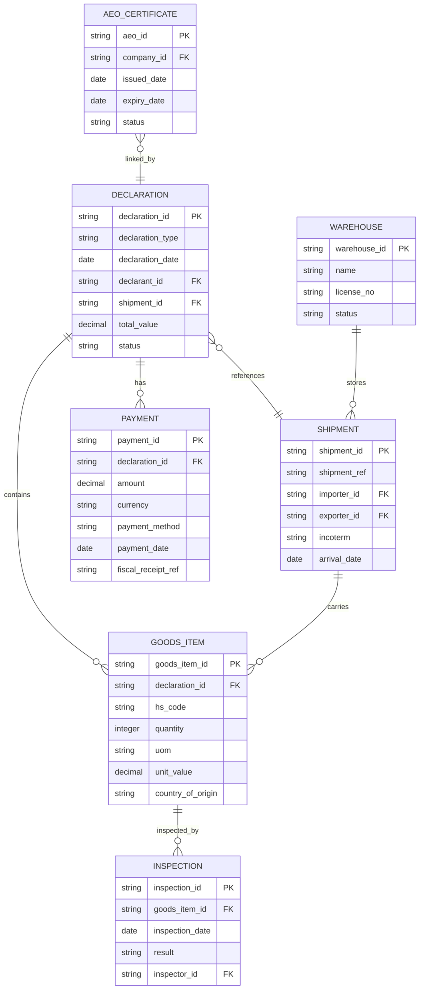

# Database schema mapped to Ethiopian Customs legal articles

This file provides a compact ERD (Mermaid), sample SQL DDL for core tables, and a mapping from each table to the primary legal instruments cited in the 2017 Customs Guide.

## ERD (Mermaid)



## Sample SQL DDL (Postgres-style, simplified)

```sql
CREATE TABLE declaration (
  declaration_id TEXT PRIMARY KEY,
  declaration_type TEXT NOT NULL,
  declaration_date DATE NOT NULL,
  declarant_id TEXT NOT NULL,
  shipment_id TEXT,
  total_value NUMERIC(14,2),
  status TEXT
);

CREATE TABLE shipment (
  shipment_id TEXT PRIMARY KEY,
  shipment_ref TEXT,
  importer_id TEXT,
  exporter_id TEXT,
  incoterm TEXT,
  arrival_date DATE
);

CREATE TABLE goods_item (
  goods_item_id TEXT PRIMARY KEY,
  declaration_id TEXT REFERENCES declaration(declaration_id),
  hs_code TEXT,
  quantity INTEGER,
  uom TEXT,
  unit_value NUMERIC(14,2),
  country_of_origin TEXT
);

CREATE TABLE payment (
  payment_id TEXT PRIMARY KEY,
  declaration_id TEXT REFERENCES declaration(declaration_id),
  amount NUMERIC(14,2),
  currency TEXT,
  payment_method TEXT,
  payment_date DATE,
  fiscal_receipt_ref TEXT
);

CREATE TABLE warehouse (
  warehouse_id TEXT PRIMARY KEY,
  name TEXT,
  license_no TEXT,
  status TEXT
);

CREATE TABLE aeo_certificate (
  aeo_id TEXT PRIMARY KEY,
  company_id TEXT,
  issued_date DATE,
  expiry_date DATE,
  status TEXT
);

CREATE TABLE inspection (
  inspection_id TEXT PRIMARY KEY,
  goods_item_id TEXT REFERENCES goods_item(goods_item_id),
  inspection_date DATE,
  result TEXT,
  inspector_id TEXT
);
```

## Table → Legal source mapping (high-level)

- declaration
  - Customs Proclamation No. 859/2014: powers, declaration requirements, offences, penalties
  - Customs Regulation No. 409/2017: procedural rules for submission and processing
  - Declaration form codes (IM4, IM5, IM6, IM7, IM8-EX8) — operational forms

- shipment
  - Customs Proclamation 859/2014: shipment controls, release
  - Regulation 409/2017: shipment/transport rules and transit procedures
  - Customs Transit Directive; Temporary Storage Procedures

- goods_item
  - HS Tariff Classification; Customs Tariff Book — classification fields (hs_code)
  - WTO Customs Valuation Agreement; VAT Proclamation No.285/2002; Excise Proclamation No.307/2002 — valuation/units
  - Sector-specific laws (veterinary, food & drugs) for controlled goods

- payment
  - VAT, Excise, Income Tax, Surtax proclamations/regulations — tax liabilities captured here
  - NBE Foreign Exchange Directives where forex/payment method matters
  - Payments-related directives referenced in guide (e.g., payments lifecycle scripts)

- warehouse
  - Customs Warehouse Administrative Directive No.40/2002 — license_no, status, operations
  - Council of Ministers Regulation 409/2017 — storage/temporary import rules

- aeo_certificate
  - Authorized Economic Operator (AEO) Directive No.65/2004 — certificate lifecycle and privileges

- inspection
  - Inspection rules under Proclamation 859/2014 and relevant sector laws (veterinary, radiation, etc.)
  - Disposal of Abandoned Goods Directive No.56/2003 (when inspections lead to abandonment)

- penalties / enforcement (recommended extra table)
  - Forfeiture & Confiscation provisions in Customs Proclamation; Administrative Penalties

## Notes & recommended next steps

- This is a minimal, normalization-focused starting schema. Production schema should add audit fields, lookup tables (countries, currencies, units, tariff rates), user/roles/permissions, attachments (documents), and index plans for HS lookups.
- Next: map specific article numbers (Proclamation 859 articles, Regulation 409 clauses, and directive numbers like Dir. No.40/2002) to individual columns/constraints and create a CSV crosswalk.

---

Files created:
- `docs/db-schema.md`

Would you like me to: export an ERD PNG/SVG, generate the CSV crosswalk (article→column), or scaffold a migration SQL file next?